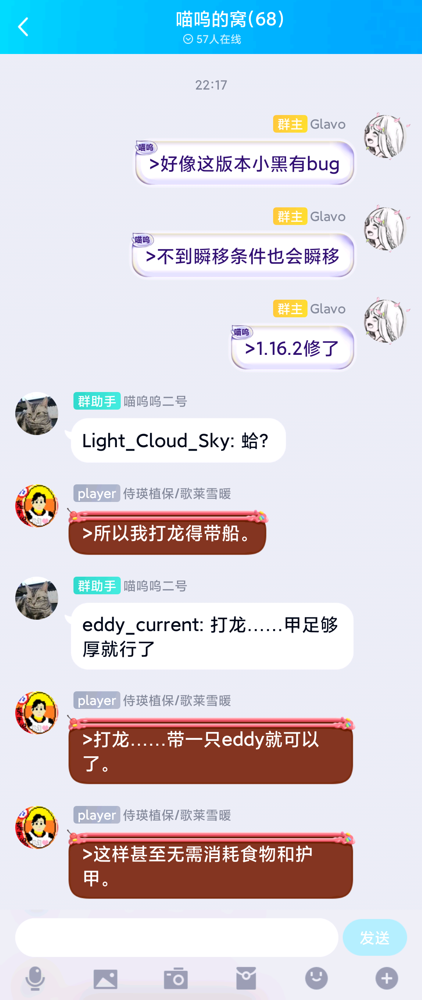

# 喵呜呜二号

喵呜的窝服务器 QQ 群助手，使用 [mirai](https://github.com/mamoe/mirai) 与 QQ 通信，
遵循 [GNU AFFERO GENERAL PUBLIC LICENSE version 3 with Mamoe Exceptions ](https://github.com/mamoe/mirai) 协议开源。

喵呜呜二号本身只为喵呜的窝服务器开发，并未特意简化配置方式，但通过很简单修改应该能够轻松的在自己的服务器中使用。

执行命令与群聊内容同步至服务器需要服务器开启 rcon 功能，
服务器内容播报和同步聊天内容至群中需要喵呜呜二号与 mc 服务端在同一服务器上运行，
并需要创建 `/tmp/mc` 命名管道以供通信。

## 功能

### 群指令

喵呜呜二号会在群中识别一系列指令并执行，当前支持的指令有：

  * `#ip`: 显示服务器当前 IP 地址
  * `#list`: 显示当前服务器玩家在线列表
  * `#whitelist <玩家名称>`: 将用户添加到服务器白名单中（需要 3 级权限）
  * `#ban <玩家名称>`: 将用户添加到服务器黑名单中（需要 3 级权限）
  * `#recall`: 撤回群中所回复的消息（需要2级权限）
  * `#donate`: 在群中展示捐献链接（[捐赠支持喵呜呜的服务器/开源项目](https://donate.glavo.site/)）
  * `#live`: 在群中播报开播提示（BILIBILI 直播间 [331537](https://live.bilibili.com/331537)）
  * `#sp <玩家名称/昵称>`: 直播时让服主旁观对应的玩家（需要 1 级权限）

### 自动播报

喵呜呜二号会在玩家上下线/取得进度/达成目标/完成挑战时自动在群中播报消息。

### 消息同步

喵呜呜二号支持服务器与 QQ 群消息双向同步。

群中以 ‘>’ 开头的消息会被同步到服务器中，而服务器中的聊天内容会默认自动同步到群内（以 ‘;;’ 开头的消息除外）。

支持在服务器中艾特群成员，支持将群中图片转发至服务器中（显示为“[图片]”，对这段文字定义了 `clickEvent`，点击即可在浏览器中打开图片）

## 原理

喵呜呜二号使用 [mirai](https://github.com/mamoe/mirai) 在 QQ 中接受与发送消息，
使用 [Glavo/rcon-java](https://github.com/Glavo/rcon-java) 将命令发送给 mc 服务器。

由于喵窝服务器为纯洁原版服，不能使用插件获取服务器消息，所以选择将服务器控制台消息重定向至一个命名管道中，
然后喵呜呜二号使用正则解析内容。

由于写入 FIFO 可能阻塞，直接使用 `tee` 重定向可能导致服务器产生问题，
于是这里简单实现了一个[按行缓冲的 buffer](cbuffer/cbuffer.cpp)临时存放消息，避免服务器控制台输出阻塞。

## 捐赠支持

## 通过爱发电捐赠

每个月固定金额捐赠支持，请访问我的爱发电主页：[Glavo - 爱发电](https://afdian.net/@Glavo)。

## 通过支付宝捐赠

## 通过微信捐赠

